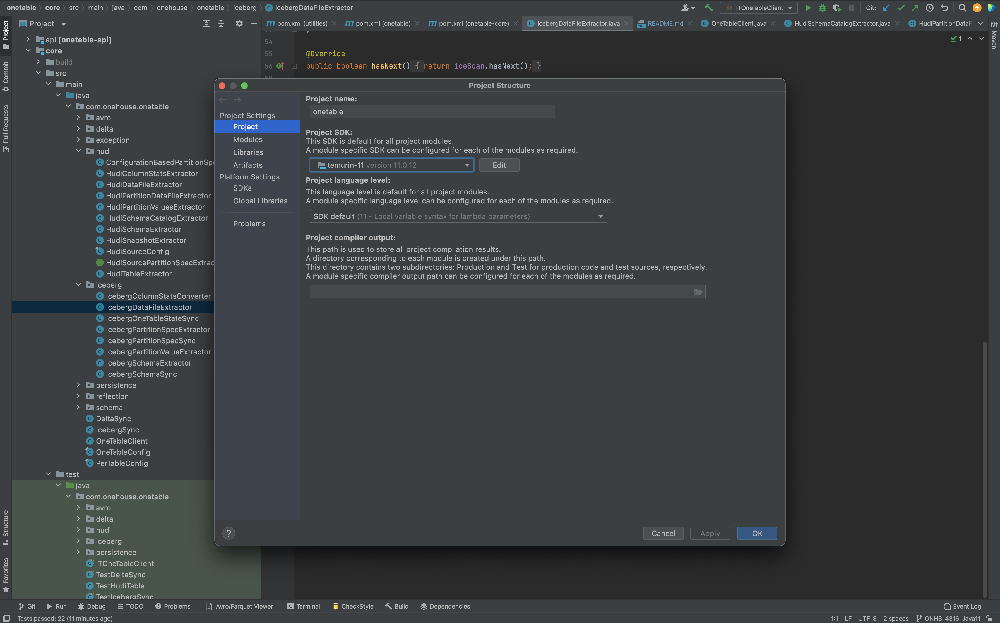

<!--
 - Licensed to the Apache Software Foundation (ASF) under one
 - or more contributor license agreements.  See the NOTICE file
 - distributed with this work for additional information
 - regarding copyright ownership.  The ASF licenses this file
 - to you under the Apache License, Version 2.0 (the
 - "License"); you may not use this file except in compliance
 - with the License.  You may obtain a copy of the License at
 - 
 -     http://www.apache.org/licenses/LICENSE-2.0
 - 
 - Unless required by applicable law or agreed to in writing, software
 - distributed under the License is distributed on an "AS IS" BASIS,
 - WITHOUT WARRANTIES OR CONDITIONS OF ANY KIND, either express or implied.
 - See the License for the specific language governing permissions and 
 - limitations under the License.
-->

# Apache XTable™ (Incubating)

[](https://github.com/apache/incubator-xtable/actions/workflows/mvn-ci-build.yml)

Apache XTable™ (Incubating) is a cross-table converter for table formats that facilitates omni-directional interoperability across
data processing systems and query engines. Currently, Apache XTable™ supports widely adopted open-source table formats such as
Apache Hudi, Apache Iceberg, and Delta Lake.

Apache XTable™ simplifies data lake operations by leveraging a common model for table representation. This allows users to write
data in one format while still benefiting from integrations and features available in other formats. For instance,
Apache XTable™ enables existing Hudi users to seamlessly work with Databricks's Photon Engine or query Iceberg tables with
Snowflake. Creating transformations from one format to another is straightforward and only requires the implementation
of a few interfaces, which we believe will facilitate the expansion of supported source and target formats in the
future.

# Building the project and running tests.
1. Use Java 11 for building the project. If you are using another Java version, you can use [jenv](https://github.com/jenv/jenv) to use multiple Java versions locally.
2. Build the project using `mvn clean package`. Use `mvn clean package -DskipTests` to skip tests while building.
3. Use `mvn clean test` or `mvn test` to run all unit tests. If you need to run only a specific test you can do this
   by something like `mvn test -Dtest=TestDeltaSync -pl xtable-core`.
4. Similarly, use `mvn clean verify` or `mvn verify` to run integration tests.

**Note:** When using Maven version 3.9 or above, Maven automatically caches the build. To ignore build caching, you can 
add the `-Dmaven.build.cache.enabled=false` parameter. For example, `mvn clean package -DskipTests -Dmaven.build.cache.enabled=false`


# Style guide
1. We use [Maven Spotless plugin](https://github.com/diffplug/spotless/tree/main/plugin-maven) and 
   [Google java format](https://github.com/google/google-java-format) for code style.
2. Use `mvn spotless:check` to find out code style violations and `mvn spotless:apply` to fix them. 
   Code style check is tied to compile phase by default, so code style violations will lead to build failures.

# Running the bundled jar
1. Get a pre-built bundled jar or create the jar with `mvn install -DskipTests`
2. Create a yaml file that follows the format below:
```yaml
sourceFormat: HUDI
targetFormats:
  - DELTA
  - ICEBERG
datasets:
  -
    tableBasePath: s3://tpc-ds-datasets/1GB/hudi/call_center
    tableDataPath: s3://tpc-ds-datasets/1GB/hudi/call_center/data
    tableName: call_center
    namespace: my.db
  -
    tableBasePath: s3://tpc-ds-datasets/1GB/hudi/catalog_sales
    tableName: catalog_sales
    partitionSpec: cs_sold_date_sk:VALUE
  -
    tableBasePath: s3://hudi/multi-partition-dataset
    tableName: multi_partition_dataset
    partitionSpec: time_millis:DAY:yyyy-MM-dd,type:VALUE
  -
    tableBasePath: abfs://container@storage.dfs.core.windows.net/multi-partition-dataset
    tableName: multi_partition_dataset
```
- `sourceFormat`  is the format of the source table that you want to convert
- `targetFormats` is a list of formats you want to create from your source tables
- `tableBasePath` is the basePath of the table
- `tableDataPath` is an optional field specifying the path to the data files. If not specified, the tableBasePath will be used. For Iceberg source tables, you will need to specify the `/data` path.
- `namespace` is an optional field specifying the namespace of the table and will be used when syncing to a catalog.
- `partitionSpec` is a spec that allows us to infer partition values. This is only required for Hudi source tables. If the table is not partitioned, leave it blank. If it is partitioned, you can specify a spec with a comma separated list with format `path:type:format`
  - `path` is a dot separated path to the partition field
  - `type` describes how the partition value was generated from the column value
    - `VALUE`: an identity transform of field value to partition value
    - `YEAR`: data is partitioned by a field representing a date and year granularity is used
    - `MONTH`: same as `YEAR` but with month granularity
    - `DAY`: same as `YEAR` but with day granularity
    - `HOUR`: same as `YEAR` but with hour granularity
  - `format`: if your partition type is `YEAR`, `MONTH`, `DAY`, or `HOUR` specify the format for the date string as it appears in your file paths
3. The default implementations of table format converters can be replaced with custom implementations by specifying a converter configs yaml file in the format below:
```yaml
# conversionSourceProviderClass: The class name of a table format's converter factory, where the converter is
#     used for reading from a table of this format. All user configurations, including hadoop config
#     and converter specific configuration, will be available to the factory for instantiation of the
#     converter.
# conversionTargetProviderClass: The class name of a table format's converter factory, where the converter is
#     used for writing to a table of this format.
# configuration: A map of configuration values specific to this converter.
tableFormatConverters:
    HUDI:
      conversionSourceProviderClass: org.apache.xtable.hudi.HudiTableStateProvider
    DELTA:
      conversionTargetProviderClass: org.apache.xtable.delta.DeltaConversionTarget
      configuration:
        spark.master: local[2]
        spark.app.name: xtable
```
4. A catalog can be used when reading and updating Iceberg tables. The catalog can be specified in a yaml file and passed in with the `--icebergCatalogConfig` option. The format of the catalog config file is:
```yaml
catalogImpl: io.my.CatalogImpl
catalogName: name
catalogOptions: # all other options are passed through in a map
  key1: value1
  key2: value2
```
5. Run with `java -jar xtable-utilities/target/xtable-utilities_2.12-0.2.0-SNAPSHOT-bundled.jar --datasetConfig my_config.yaml [--hadoopConfig hdfs-site.xml] [--convertersConfig converters.yaml] [--icebergCatalogConfig catalog.yaml]`
The bundled jar includes hadoop dependencies for AWS, Azure, and GCP. Sample hadoop configurations for configuring the converters 
can be found in the [xtable-hadoop-defaults.xml](https://github.com/apache/incubator-xtable/blob/main/xtable-utilities/src/main/resources/xtable-hadoop-defaults.xml) file.
The custom hadoop configurations can be passed in with the `--hadoopConfig [custom-hadoop-config-file]` option.
The config in custom hadoop config file will override the default hadoop configurations. For an example
of a custom hadoop config file, see [hadoop.xml](https://xtable.apache.org/docs/fabric#step-2-translate-source-table-to-delta-lake-format-using-apache-xtable-incubating).

# Running using docker

1. Build the docker image using `docker build . -t xtable`
2. Mount the config files on the container and run the container:

```
docker run \
  -v ./xtable/config.yml:/xtable/config.yml \
  -v ./xtable/core-site.xml:/xtable/core-site.xml \
  -v ./xtable/catalog.yml:/xtable/catalog.yml \
  xtable \
  --datasetConfig /xtable/config.yml --hadoopConfig /xtable/core-site.xml --icebergCatalogConfig xtable/catalog.yml
```

# Contributing
## Setup
For setting up the repo on IntelliJ, open the project and change the Java version to Java 11 in File->ProjectStructure


You have found a bug, or have a cool idea you that want to contribute to the project ? Please file a GitHub issue [here](https://github.com/apache/incubator-xtable/issues)

## Adding a new target format
Adding a new target format requires a developer implement [ConversionTarget](./api/src/main/java/org/apache/xtable/spi/sync/ConversionTarget.java). Once you have implemented that interface, you can integrate it into the [ConversionController](./core/src/main/java/org/apache/xtable/conversion/ConversionController.java). If you think others may find that target useful, please raise a Pull Request to add it to the project.

## Overview of the sync process

