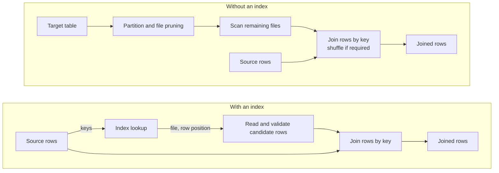
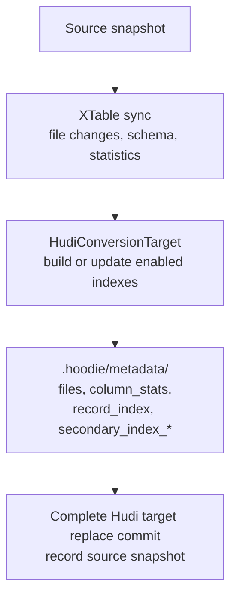
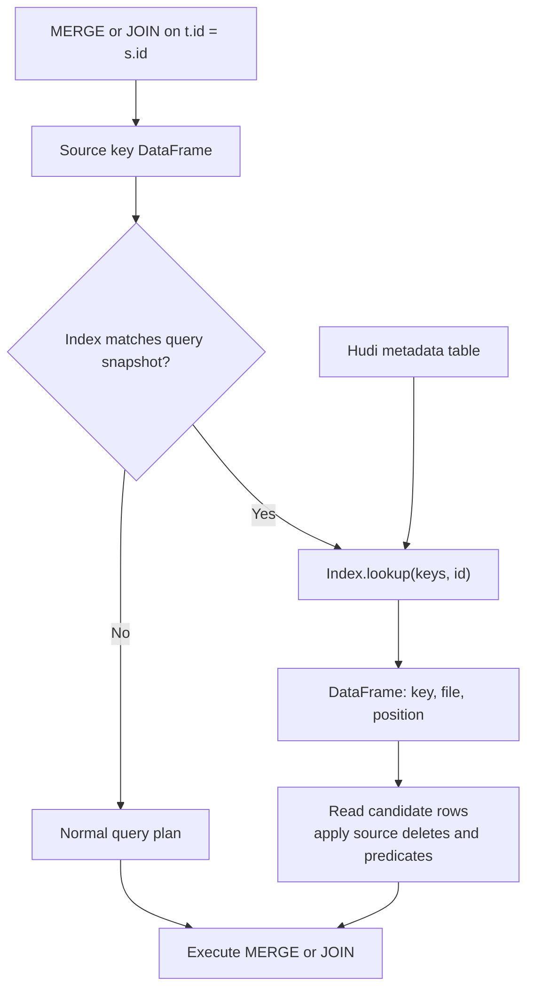

<!--
  Licensed to the Apache Software Foundation (ASF) under one or more
  contributor license agreements.  See the NOTICE file distributed with
  this work for additional information regarding copyright ownership.
  The ASF licenses this file to You under the Apache License, Version 2.0
  (the "License"); you may not use this file except in compliance with
  the License.  You may obtain a copy of the License at

       http://www.apache.org/licenses/LICENSE-2.0

  Unless required by applicable law or agreed to in writing, software
  distributed under the License is distributed on an "AS IS" BASIS,
  WITHOUT WARRANTIES OR CONDITIONS OF ANY KIND, either express or implied.
  See the License for the specific language governing permissions and
  limitations under the License.
-->
# RFC-4: Index Support in Apache XTable

## Proposers

- @vinishjail97

## Approvers

- Anyone from the XTable community can approve or add feedback.

## Status

GH Feature Request: https://github.com/apache/incubator-xtable/issues/887

dev@ discussion: https://lists.apache.org/thread/kb3p85rgy0qkvjgdgn3580h36y1qov8c

Status: Proposed.

## Abstract

Table formats such as Hudi, Iceberg, Delta Lake and Paimon track data files and their statistics. Parquet files also
contain column statistics in their footers. Query engines use these statistics to skip files that cannot match a filter.
For joins and merges, pruning helps when matching keys occupy a small set of partitions or files. When updates spread
across many files, query engines still scan the remaining files and may shuffle their rows to match keys.

This RFC proposes a canonical model for record-level (primary) and secondary indexes in XTable, with future support for
expression and vector indexes. XTable will use Hudi's metadata table to build indexes for Iceberg, Delta Lake, Paimon
and Parquet, with a lookup API that returns matching file paths and row positions to query engines.

The Iceberg secondary index proposal describes similar capabilities [^1]. When a published Iceberg specification includes
index definitions, XTable can support conversion between compatible Hudi and Iceberg indexes.

## Background

### Joins and merges work on keys

A join or merge matches rows between a source and a target through a key. For production workloads, a merge often
applies a small batch of updates to a large target table. Indexes help when the source supplies a selective set of
lookup keys, including joins where one side is small. The benefit depends on the number of matching rows and the query
engine's ability to read those rows efficiently.



### Index types

| Index type | Mapping | Use |
|------------|---------|-----|
| Column / partition statistics | File or partition → column statistics | Filter pruning |
| Record-level index (RLI) | Record key → record location | Resolve primary keys or physical row identifiers |
| Secondary index (SI) | Column value → record keys | Joins and merges on an indexed column |
| Expression index | Expression over columns → file statistics | Filters on fields extracted from semi-structured data, such as JSON |
| Vector index | Query embedding → nearby record locations | Nearest-neighbour search |

### The Hudi metadata table

Uber describes production use of Hudi, while Walmart reports evaluations of Hudi on its workloads [^2][^3].

Hudi stores indexes in a metadata table under `.hoodie/metadata/` and coordinates its updates with the data table
[^4][^5]. The XTable Hudi target already registers external Parquet files and maintains file metadata and supported column
statistics. This proposal adds record-level and secondary index maintenance to that sync process. Hudi already includes
expression indexing and basic vector search [^6][^7]. XTable support for expression and vector indexes remains future work.

## Design goals

1. **Indexes are derived state.** The source table remains authoritative, and each index identifies the source snapshot
   that its entries represent.
2. **Indexes are part of XTable sync.** Target-table properties enable index maintenance within the existing sync process.
3. **Index builds scale with the data.** File-level indexing retains Java support, while record-level and secondary index
   builds run on a distributed engine through an execution provider.

## Implementation

### Write flow



Index maintenance is new functionality within the Hudi target sync. The first build reads existing data files, and later
syncs update index entries for source changes. Both operations use the metadata table at `{dataPath}/.hoodie/metadata/`.
The source adapter must locate all live rows in the registered Parquet files before it enables record-level indexing.
Layouts that require unsupported log merging or row resolution must use the normal query path.

### Record keys and row locations

For external files without a usable record key, XTable will identify each row by its physical location:

```
recordKey := "{filePathRelativeToDataDir}_{rowPosition}"
```

The row position is zero-based, and decoding splits the key at the final underscore. The identifier remains valid while
the file remains unchanged. When the source rewrites a file, sync removes its old index entries and adds entries for the
replacement files. A secondary index on a business column, such as `id`, maps its values to these physical identifiers.

Native record keys require a mapping to the file and row position; they cannot use physical-key decoding. Iceberg
identifier fields alone do not guarantee unique values [^8]. External-file key generation and index maintenance require
Hudi changes before XTable can provide this lookup contract.

### Execution and configuration

`HudiExecutionEngineProvider` will select Java for file-level indexing or Spark for distributed index builds. Java remains
the default, and record-level or secondary indexing requires Spark. The Hudi target will reject an unsupported engine
configuration before sync starts.

The following proposed properties belong to the Hudi `TargetTable.additionalProperties` map:

| Property | Default | Meaning |
|----------|---------|---------|
| `xtable.hudi.target.execution_engine` | `java` | Execution engine (`java` or `spark`) |
| `xtable.hudi.target.metadata.record_index.enabled` | `false` | Enable the record-level index |
| `xtable.hudi.target.metadata.secondary_index.columns` | unset | Columns with separate secondary indexes; also enables RLI |
| `xtable.hudi.target.metadata.secondary_index.parallelism` | Hudi default | Parallelism for secondary index builds and updates |

Existing column-statistics behavior stays unchanged. Partition statistics for external files require additional Hudi
support; table version 9 alone does not enable them [^9].

### Query flow and lookup API

A query engine can use the index to find target rows for a merge such as:

```sql
MERGE INTO customers t
USING source_updates s
ON t.id = s.id
WHEN MATCHED THEN UPDATE SET name = s.name
WHEN NOT MATCHED THEN INSERT (id, name) VALUES (s.id, s.name);
```



Each `Index` instance will bind to one table and one completed Hudi target instant. The Spark lookup interface will use
DataFrames, represented as `Dataset<Row>` in Java:

```java
public interface Index {
  boolean doesIndexExist(String columnName);
  Optional<TableSyncMetadata> lastSynced();
  Dataset<Row> lookup(Dataset<Row> keys, String columnName);
}
```

The input DataFrame contains one `key` column with the indexed column's type. The output contains `key` with that same
type, `file` as an absolute path string, and `position` as a long. Each distinct input key returns all matching physical
locations; a missing key returns no rows. Lookup supports single-column equality, and null keys return no matches.

The query engine joins locations back to the source rows and retains unmatched rows for merge inserts. It applies the
source format's delete rules and remaining query predicates. Unsupported predicates use the normal query plan.

The Spark API and execution provider belong in the proposed `xtable-spark-runtime` module [^10]. Shared index metadata
belongs in the core modules. Expression and vector lookups require separate contracts beyond this equality API.

### Consistency

The Hudi target sync must complete file and index updates before it marks the corresponding replace commit complete.
`lastSynced()` must describe the same completed target instant that lookup reads, including during lazy DataFrame
execution. Failed or incomplete index builds must remain unavailable to lookup.

The query engine must verify that the index represents the source snapshot selected for the query. If the index is
missing, stale or unavailable for that snapshot, the engine uses the normal query plan. This follows the snapshot
mapping model in the Iceberg proposal [^1]. Plain Parquet requires an immutable file set during indexing and query
execution because it has no table snapshot protocol.

## Rollout/Adoption Plan

New indexes are opt-in, and enabling an index builds it during the next sync. Existing users retain their current sync
behavior. Record-level and secondary indexing require Spark and compatible Hudi support for external-file keys and
index updates. XTable must validate the required Hudi version and table version before it enables these indexes.

## Test Plan

- **Configuration.** Verify property translation, Spark provider selection and rejection of record-level indexing with Java.
- **Lookup.** Compare DataFrame results with source rows, including repeated values, missing keys, nulls and typed keys.
- **Maintenance.** Verify initial builds, incremental inserts, file removal, rewrites and source delete handling.
- **Consistency.** Verify failure recovery, incomplete builds, stale snapshots and concurrent sync during lazy lookup.
- **Compatibility.** Run file-level sync on a Spark-free Java classpath and record-level index tests under Spark.
- **Performance.** Compare index-aware merges with the normal query plan using concentrated and widely distributed keys.
  Report files read, rows shuffled, build cost and query time.

## References

[^1]: [Iceberg secondary indexes design](https://docs.google.com/document/d/1N6a2IOzC6Qsqv7NBqHKesees4N6WF49YUSIX2FrF7S0)
[^2]: [Uber's lakehouse architecture](https://www.uber.com/blog/ubers-lakehouse-architecture/)
[^3]: [Lakehouse at Fortune 1 scale](https://medium.com/walmartglobaltech/lakehouse-at-fortune-1-scale-480bcb10391b)
[^4]: [Hudi table metadata](https://hudi.apache.org/docs/metadata/)
[^5]: [Hudi record-level index](https://hudi.apache.org/blog/2023/11/01/record-level-index/)
[^6]: [Hudi expression indexes](https://hudi.apache.org/docs/indexes/#expression-index)
[^7]: [Hudi vector search implementation](https://github.com/apache/hudi/blob/master/hudi-spark-datasource/hudi-spark-common/src/main/scala/org/apache/spark/sql/hudi/analysis/HoodieVectorSearchPlanBuilder.scala)
[^8]: [Iceberg identifier fields](https://iceberg.apache.org/spec/#identifier-field-ids)
[^9]: [Hudi table version 9 support](https://github.com/apache/incubator-xtable/issues/834)
[^10]: [Spark runtime module proposal](https://github.com/apache/incubator-xtable/issues/836)
