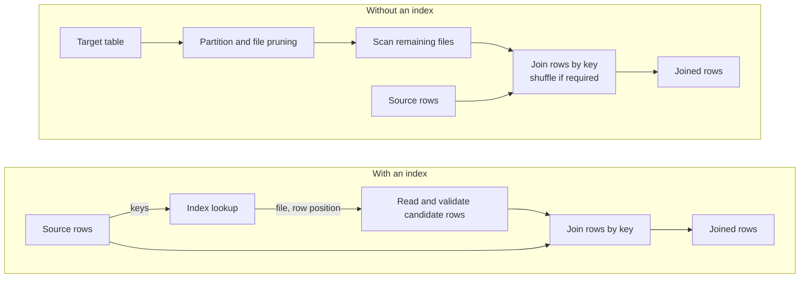
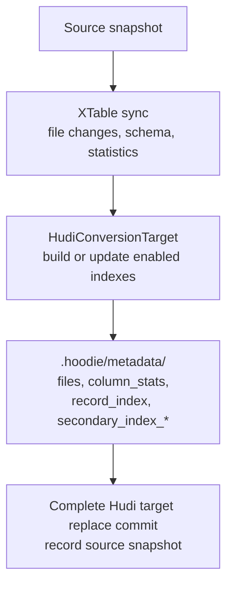
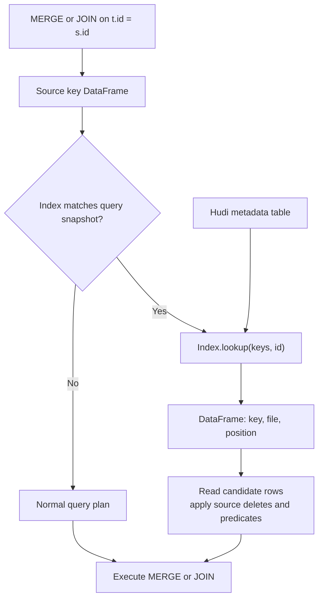

<!--
  Licensed to the Apache Software Foundation (ASF) under one or more
  contributor license agreements.  See the NOTICE file distributed with
  this work for additional information regarding copyright ownership.
  The ASF licenses this file to You under the Apache License, Version 2.0
  (the "License"); you may not use this file except in compliance with
  the License.  You may obtain a copy of the License at

       http://www.apache.org/licenses/LICENSE-2.0

  Unless required by applicable law or agreed to in writing, software
  distributed under the License is distributed on an "AS IS" BASIS,
  WITHOUT WARRANTIES OR CONDITIONS OF ANY KIND, either express or implied.
  See the License for the specific language governing permissions and
  limitations under the License.
-->
# RFC-4: Index Support in Apache XTable

## Proposers

- @vinishjail97

## Approvers

- Anyone from the XTable community can approve or add feedback.

## Status

GH Feature Request: https://github.com/apache/incubator-xtable/issues/887

dev@ discussion: https://lists.apache.org/thread/kb3p85rgy0qkvjgdgn3580h36y1qov8c

Status: Proposed.

## Abstract

Table formats such as Hudi, Iceberg, Delta Lake and Paimon track data files and their statistics. Parquet files also
contain column statistics in their footers. Query engines use these statistics to skip files that cannot match a filter.
For joins and merges, pruning helps when matching keys occupy a small set of partitions or files. When updates spread
across many files, query engines still scan the remaining files and may shuffle their rows to match keys.

This RFC proposes a canonical model for record-level (primary) and secondary indexes in XTable, with future support for
expression and vector indexes. XTable will use Hudi's metadata table to build indexes for Iceberg, Delta Lake, Paimon
and Parquet, with a lookup API that returns matching file paths and row positions to query engines.

The Iceberg secondary index proposal describes similar capabilities [^1]. When a published Iceberg specification includes
index definitions, XTable can support conversion between compatible Hudi and Iceberg indexes.

## Background

### Joins and merges work on keys

A join or merge matches rows between a source and a target through a key. For production workloads, a merge often
applies a small batch of updates to a large target table. Indexes help when the source supplies a selective set of
lookup keys, including joins where one side is small. The benefit depends on the number of matching rows and the query
engine's ability to read those rows efficiently.


```mermaid
flowchart TB
  subgraph scan["Without an index"]
    direction LR
    T1[Target table] --> P[Partition and file pruning]
    P --> R1[Scan remaining files]
    R1 --> J1["Join rows by key<br/>shuffle if required"]
    S1[Source rows] --> J1
    J1 --> M1[Joined rows]
  end
  subgraph idx["With an index"]
    direction LR
    S2[Source rows] -->|keys| L[Index lookup]
    L -->|"file, row position"| R2[Read and validate candidate rows]
    R2 --> J2[Join rows by key]
    S2 --> J2
    J2 --> M2[Joined rows]
  end
  scan ~~~ idx
```

### Index types

| Index type | Mapping | Use |
|------------|---------|-----|
| Column / partition statistics | File or partition → column statistics | Filter pruning |
| Record-level index (RLI) | Record key → record location | Resolve primary keys or physical row identifiers |
| Secondary index (SI) | Column value → record keys | Joins and merges on an indexed column |
| Expression index | Expression over columns → file statistics | Filters on fields extracted from semi-structured data, such as JSON |
| Vector index | Query embedding → nearby record locations | Nearest-neighbour search |

### The Hudi metadata table

Uber describes production use of Hudi, while Walmart reports evaluations of Hudi on its workloads [^2][^3].

Hudi stores indexes in a metadata table under `.hoodie/metadata/` and coordinates its updates with the data table
[^4][^5]. The XTable Hudi target already registers external Parquet files and maintains file metadata and supported column
statistics. This proposal adds record-level and secondary index maintenance to that sync process. Hudi already includes
expression indexing and basic vector search [^6][^7]. XTable support for expression and vector indexes remains future work.

## Design goals

1. **Indexes are derived state.** The source table remains authoritative, and each index identifies the source snapshot
   that its entries represent.
2. **Indexes are part of XTable sync.** Target-table properties enable index maintenance within the existing sync process.
3. **Index builds scale with the data.** File-level indexing retains Java support, while record-level and secondary index
   builds run on a distributed engine through an execution provider.

## Implementation

### Write flow


```mermaid
flowchart TB
  SRC[Source snapshot] --> SYNC["XTable sync<br/>file changes, schema, statistics"]
  SYNC --> HT["HudiConversionTarget<br/>build or update enabled indexes"]
  HT --> MDT[".hoodie/metadata/<br/>files, column_stats,<br/>record_index, secondary_index_*"]
  MDT --> COMMIT["Complete Hudi target replace commit<br/>record source snapshot"]
```

Index maintenance is new functionality within the Hudi target sync. The first build reads existing data files, and later
syncs update index entries for source changes. Both operations use the metadata table at `{dataPath}/.hoodie/metadata/`.
The source adapter must locate all live rows in the registered Parquet files before it enables record-level indexing.
Layouts that require unsupported log merging or row resolution must use the normal query path.

### Record keys and row locations

For external files without a usable record key, XTable will identify each row by its physical location:

```
recordKey := "{filePathRelativeToDataDir}_{rowPosition}"
```

The row position is zero-based, and decoding splits the key at the final underscore. The identifier remains valid while
the file remains unchanged. When the source rewrites a file, sync removes its old index entries and adds entries for the
replacement files. A secondary index on a business column, such as `id`, maps its values to these physical identifiers.

Native record keys require a mapping to the file and row position; they cannot use physical-key decoding. Iceberg
identifier fields alone do not guarantee unique values [^8]. External-file key generation and index maintenance require
Hudi changes before XTable can provide this lookup contract.

### Execution and configuration

`HudiExecutionEngineProvider` selects the Java or the Spark engine for the Hudi target. Java remains the default and can
build every index on small tables. Spark distributes record-level and secondary index builds, reusing the active Spark
session. The Hudi target rejects an unknown engine before sync starts.

The following properties belong to the Hudi `TargetTable.additionalProperties` map:

| Property | Default | Meaning |
|----------|---------|---------|
| `xtable.hudi.target.execution.engine` | `java` | Execution engine (`java` or `spark`) |
| `xtable.hudi.target.table_version` | `6` | Hudi table version; record-level and secondary indexes require `9` |
| `xtable.hudi.target.secondary.index.column` | unset | Column with a secondary index; also enables the global record-level index |
| `xtable.hudi.target.metadata.record.index.min.filegroup.count` | Hudi default | Lower bound of record-level index file groups, set together with the upper bound |
| `xtable.hudi.target.metadata.record.index.max.filegroup.count` | Hudi default | Upper bound of record-level index file groups |
| `xtable.hudi.target.metadata.index.secondary.parallelism` | Hudi default | Parallelism for secondary index records |

A sync names one secondary index column, and a table can have secondary indexes on several columns. An incremental sync
makes no Hudi commit when the source has no new snapshot, so it cannot build the index of a column that is added after
the first sync, or added again after a drop. XTable builds such an index with Hudi's indexer (`HoodieSparkIndexClient`)
from the files the table already has. Later syncs keep every existing secondary index current, whichever column they
name.

Existing column-statistics behavior stays unchanged. Partition statistics for external files require additional Hudi
support; table version 9 alone does not enable them [^9].

### Query flow and lookup API

A query engine can use the index to find target rows for a merge such as:

```sql
MERGE INTO customers t
USING source_updates s
ON t.id = s.id
WHEN MATCHED THEN UPDATE SET name = s.name
WHEN NOT MATCHED THEN INSERT (id, name) VALUES (s.id, s.name);
```


```mermaid
flowchart TB
  Q["MERGE or JOIN on t.id = s.id"] --> KEYS[Source key DataFrame]
  KEYS --> CHECK{Index matches query snapshot?}
  CHECK -->|Yes| LOOKUP["Index.lookup(keys, id)"]
  MDT[Hudi metadata table] --> LOOKUP
  LOOKUP --> LOC["DataFrame: key, file, position"]
  LOC --> READ["Read candidate rows<br/>apply source deletes and predicates"]
  READ --> EXEC[Execute MERGE or JOIN]
  CHECK -->|No| SCAN[Normal query plan]
  SCAN --> EXEC
```

The index API lives in `xtable-core` (`org.apache.xtable.index`) and uses DataFrames, represented as `Dataset<Row>` in
Java. `HudiBackedIcebergSecondaryIndex` implements it for an Iceberg `Table`:

```java
public interface Index<T> {
  boolean doesIndexExist(String columnName);
  void syncIndex(T table, String columnName);
  void dropIndex(T table, String columnName);
  Optional<String> getLastSyncedSourceIdentifier();
  Dataset<Row> lookup(T table, Dataset<Row> keys, String columnName);
}
```

- `syncIndex` syncs the Hudi target with the current source snapshot and builds the index of the column if it does not
  exist yet. It fails when the sync fails.
- `dropIndex` drops the secondary index of one column and keeps the indexes of other columns and the record-level index.
- `getLastSyncedSourceIdentifier` returns the source commit, for Iceberg the snapshot id, that the last completed Hudi
  target commit represents.
- `lookup` takes a DataFrame with a column named after the indexed column. The index stores values as strings, so lookup
  casts the keys to strings and drops nulls. The output has the key column as a string, `_file` as an absolute path
  string, `_pos` as a long, and `_partition` as a struct in the table's partition type (null for unpartitioned tables).
  The names match Iceberg's metadata columns, so results join directly with Iceberg reads. Each key returns all of its
  locations; a missing key returns no rows.

`_file` is built from the table's data path and the path stored in the record key, so its scheme can differ from the
path in the source metadata, for example `file:/` and `/`. Callers compare paths without the scheme and authority.

The query engine joins locations back to the source rows and retains unmatched rows for merge inserts. It applies the
source format's delete rules and remaining query predicates. Unsupported predicates use the normal query plan.

Expression and vector lookups require separate contracts beyond this equality API.

### Spark SQL

The `xtable-spark-extensions` module gives the index a SQL interface in Spark. It follows Iceberg's layout: the module
holds the code, as `iceberg-spark-extensions` does, and a runtime jar such as the proposed `xtable-spark-runtime` [^10]
can bundle it, as `iceberg-spark-runtime` does. Users add the extensions after Iceberg's:

```
spark.sql.extensions=org.apache.iceberg.spark.extensions.IcebergSparkSessionExtensions,org.apache.xtable.spark.extensions.XTableSparkSessionExtensions
```

```sql
CREATE INDEX [IF NOT EXISTS] email_idx ON cat.db.customer USING xtable (email) [OPTIONS (...)];
REFRESH INDEX email_idx ON cat.db.customer;
DROP INDEX [IF EXISTS] email_idx ON cat.db.customer;

-- reads only the files that hold these keys
SELECT * FROM cat.db.customer WHERE email IN ('a@example.com', 'b@example.com');
```

Spark parses `CREATE INDEX` and `DROP INDEX`, but Iceberg's `SparkTable` does not implement Spark's `SupportsIndex`. A
planner strategy runs both commands for `USING xtable` on Iceberg tables and leaves other index types to Spark. A small
parser adds `REFRESH INDEX` and passes every other statement to the parser it wraps. The index definition is kept in the
table properties, `xtable.index.<name>.column` and `xtable.index.<name>.option.<key>`, so every session and engine can
find it. `CREATE INDEX` writes the definition only after the build succeeds. An index covers one top-level `string`, `int`
or `bigint` column, the types whose string form is the same in Spark and Hudi.

An optimizer rule uses the index for `col = literal`, `col IN (literals)` and the `InSet` form Spark uses for long lists,
alone or combined with other filters by `AND`. Iceberg does not prune files on a `_file` filter, so the rule cannot
rewrite the filter. Instead it looks the keys up, keeps the files that also survive Iceberg's partition and min/max
pruning, and stages them as the scan's task set through Iceberg's `ScanTaskSetManager` and the `scan-task-set-id` read
option. Iceberg then reads only those files. The filter stays in the plan, so the query returns the same rows as without
the rule. A key with no match turns the scan into an empty relation. The rule leaves the plan unchanged when:

- the index is not synced to the table's current snapshot,
- the query reads an older snapshot or a branch,
- Iceberg's own pruning already leaves a small scan, because a lookup runs a Spark job,
- the filter has more keys than a limit.

| Setting | Default | Meaning |
|---------|---------|---------|
| `spark.xtable.index.pruning.enabled` | `true` | Use indexes for queries |
| `spark.xtable.index.pruning.minCandidateFiles` | `32` | Use an index only if Iceberg's pruning leaves at least this many files |
| `spark.xtable.index.pruning.minCandidateBytes` | `1073741824` | ... or at least this many bytes |
| `spark.xtable.index.pruning.maxKeys` | `10000` | Do not use an index for filters with more keys |

Staged task sets are released by a query execution listener when the query ends. Joins, subqueries, `MERGE`, `UPDATE`
and `DELETE` do not use the index yet; they need the lookup to run on the keys of the other side before the scan, which
is the query flow above.

### Consistency

The Hudi target sync must complete file and index updates before it marks the corresponding replace commit complete.
`getLastSyncedSourceIdentifier()` must describe the same completed target instant that lookup reads, including during
lazy DataFrame execution. Failed or incomplete index builds must remain unavailable to lookup.

The query engine must verify that the index represents the source snapshot selected for the query. If the index is
missing, stale or unavailable for that snapshot, the engine uses the normal query plan. The Spark SQL rule compares `getLastSyncedSourceIdentifier()` with the current
snapshot of the table while it plans the query. This follows the snapshot
mapping model in the Iceberg proposal [^1]. Plain Parquet requires an immutable file set during indexing and query
execution because it has no table snapshot protocol.

## Rollout/Adoption Plan

New indexes are opt-in, and enabling an index builds it during the next sync. Existing users retain their current sync
behavior. Record-level and secondary indexing require Spark and compatible Hudi support for external-file keys and
index updates. XTable must validate the required Hudi version and table version before it enables these indexes.
The Spark SQL extensions are opt-in through `spark.sql.extensions`; sessions without them, and other engines, read the
table as before.

## Test Plan

- **Configuration.** Verify property translation, Spark provider selection and rejection of record-level indexing with Java.
- **Lookup.** Compare DataFrame results with source rows, including repeated values, missing keys, nulls and typed keys.
- **Maintenance.** Verify initial builds, incremental inserts, file removal, rewrites and source delete handling.
- **Consistency.** Verify failure recovery, incomplete builds, stale snapshots and concurrent sync during lazy lookup.
- **Spark SQL.** Compare every query that uses an index with the same query without it, and compare the files the
  rule stages with the files that hold matching rows. Cover equality, `IN`, `InSet`, combined filters, missing keys,
  time travel, the size thresholds, stale indexes, `REFRESH`, deletes, several indexes, `DROP` and re-`CREATE`.
- **Compatibility.** Run file-level sync on a Spark-free Java classpath and record-level index tests under Spark.
- **Performance.** Compare index-aware merges with the normal query plan using concentrated and widely distributed keys.
  Report files read, rows shuffled, build cost and query time.

## References

[^1]: [Iceberg secondary indexes design](https://docs.google.com/document/d/1N6a2IOzC6Qsqv7NBqHKesees4N6WF49YUSIX2FrF7S0)
[^2]: [Uber's lakehouse architecture](https://www.uber.com/blog/ubers-lakehouse-architecture/)
[^3]: [Lakehouse at Fortune 1 scale](https://medium.com/walmartglobaltech/lakehouse-at-fortune-1-scale-480bcb10391b)
[^4]: [Hudi table metadata](https://hudi.apache.org/docs/metadata/)
[^5]: [Hudi record-level index](https://hudi.apache.org/blog/2023/11/01/record-level-index/)
[^6]: [Hudi expression indexes](https://hudi.apache.org/docs/indexes/#expression-index)
[^7]: [Hudi vector search implementation](https://github.com/apache/hudi/blob/master/hudi-spark-datasource/hudi-spark-common/src/main/scala/org/apache/spark/sql/hudi/analysis/HoodieVectorSearchPlanBuilder.scala)
[^8]: [Iceberg identifier fields](https://iceberg.apache.org/spec/#identifier-field-ids)
[^9]: [Hudi table version 9 support](https://github.com/apache/incubator-xtable/issues/834)
[^10]: [Spark runtime module proposal](https://github.com/apache/incubator-xtable/issues/836)
