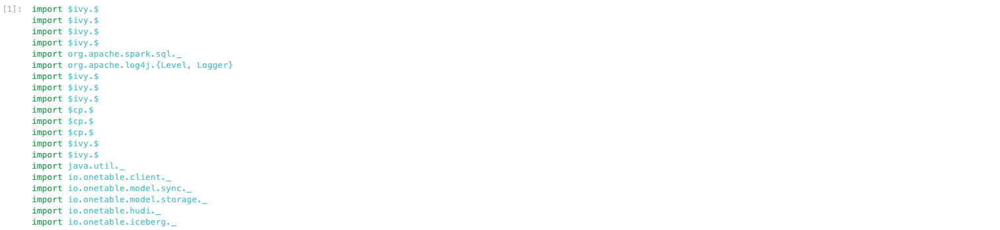
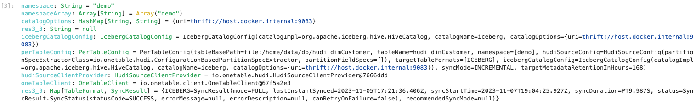
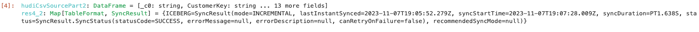
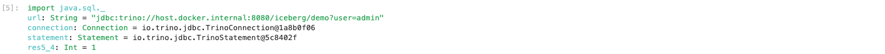
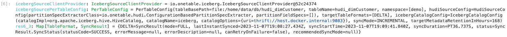
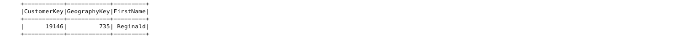
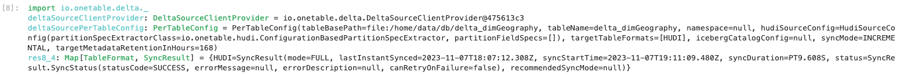
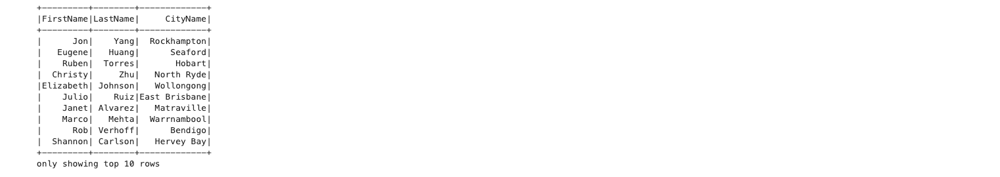

# Building interoperable tables using OneTable 
This demo walks you through a fictional use case and the steps to add interoperability between table formats using OneTable.
For this purpose, a self-contained data infrastructure is brought up as Docker containers within your computer.


## Pre-requisites
* Install Docker in your local machine
* Clone [OneTable GitHub repository](https://github.com/onetable-io/onetable)

:::note NOTE:
This demo was tested in both x86-64 and AArch64 based macOS operating systems
:::


## Setting up Docker cluster
After cloning the OneTable repository, change directory to `demo` and run the `start_demo.sh` script.
This script builds OneTable jars required for the demo and then spins up docker containers to start a Jupyter notebook
with Scala interpreter (version 2.12), Hive Metastore (version 4.0.0-alpha-2) and Trino (version 428).

```shell
cd demo
./start_demo.sh
```

### Accessing Services
#### Jupyter Notebook
To access the notebook, look for a log line during startup that contains `To access the server, open this file in a 
browser: ...  Or copy and paste one of these URLs: ...` and use the link that starts with http://127.0.0.1:8888/
to open the notebook in your browser. 

The demo is located at `work/demo.ipynb`

#### Trino
You can access the local Trino container by running `docker exec -it trino trino`

## Demo
### Import the required libraries and add necessary jars to classpath
```scala
import $ivy.`org.apache.logging.log4j:log4j-api:2.17.2`
import $ivy.`org.apache.logging.log4j:log4j-core:2.17.2`
import $ivy.`org.apache.spark::spark-sql:3.2.3`
import $ivy.`org.apache.spark:spark-hive_2.12:3.2.3`
import org.apache.spark.sql._
import org.apache.log4j.{Level, Logger}
Logger.getLogger("org").setLevel(Level.ERROR)
import $ivy.`org.apache.hudi:hudi-spark3.2-bundle_2.12:0.14.0`
import $ivy.`org.apache.hudi:hudi-java-client:0.14.0`
import $ivy.`io.delta:delta-core_2.12:2.0.2`
import $cp.`/home/jars/onetable-core-0.1.0-SNAPSHOT.jar`
import $cp.`/home/jars/onetable-api-0.1.0-SNAPSHOT.jar`
import $cp.`/home/jars/hudi-utils-0.1.0-SNAPSHOT.jar`
import $ivy.`org.apache.iceberg:iceberg-hive-runtime:1.3.1`
import $ivy.`io.trino:trino-jdbc:431`
import java.util._
import io.onetable.client._
import io.onetable.model.sync._
import io.onetable.model.storage._
import io.onetable.hudi._
import io.onetable.iceberg._
```


### Read datasets and initialize spark session
We start out our demo with 2 datasets. One in Hudi `hudi_dimCustomer` and one in Delta Lake `delta_dimGeography`.

Let's also initialize the Spark session with Hudi configs.

```scala
val hudiTableName = "hudi_dimCustomer"
val hudiBasePath = "file:/home/data/db/hudi_dimCustomer"
val writerSchema = "{\"type\":\"record\",\"name\":\"Sample\",\"fields\":[{\"name\":\"_c0\",\"type\":\"string\"},{\"name\":\"CustomerKey\",\"type\":\"string\"},{\"name\":\"GeographyKey\",\"type\":\"string\"},{\"name\":\"FirstName\",\"type\":\"string\"},{\"name\":\"LastName\",\"type\":\"string\"},{\"name\":\"BirthDate\",\"type\":\"string\"},{\"name\":\"MaritalStatus\",\"type\":\"string\"},{\"name\":\"Gender\",\"type\":\"string\"},{\"name\":\"YearlyIncome\",\"type\":\"string\"},{\"name\":\"TotalChildren\",\"type\":\"string\"},{\"name\":\"NumberChildrenAtHome\",\"type\":\"string\"},{\"name\":\"Education\",\"type\":\"string\"},{\"name\":\"Occupation\",\"type\":\"string\"},{\"name\":\"HouseOwnerFlag\",\"type\":\"string\"},{\"name\":\"NumberCarsOwned\",\"type\":\"string\"}]}"
val hudiWriteOptions = new HashMap[String, String]()
hudiWriteOptions.put("hoodie.table.name", hudiTableName)
hudiWriteOptions.put("hoodie.datasource.write.recordkey.field", "CustomerKey")
hudiWriteOptions.put("hoodie.datasource.write.partitionpath.field", "")
hudiWriteOptions.put("hoodie.datasource.write.precombine.field", "_c0")
hudiWriteOptions.put("hoodie.datasource.write.operation", "insert")
hudiWriteOptions.put("hoodie.write.schema", writerSchema)
hudiWriteOptions.put("hoodie.populate.meta.fields", "false")
hudiWriteOptions.put("hoodie.parquet.small.file.limit", "1")

val deltaTableName = "delta_dimGeography"
val deltaBasePath = "file:/home/data/db/delta_dimGeography"

val spark = org.apache.spark.sql.SparkSession.builder()
    .appName("demo")
    .config("spark.serializer", "org.apache.spark.serializer.KryoSerializer")
    .config("spark.sql.catalog.spark_catalog", "org.apache.spark.sql.hudi.catalog.HoodieCatalog")
    .config("spark.sql.extensions", "org.apache.spark.sql.hudi.HoodieSparkSessionExtension")
    .config("spark.kryo.registrator", "org.apache.spark.HoodieSparkKryoRegistrar")
    .master("local")
    .getOrCreate()
spark.sparkContext.setLogLevel("ERROR")
```


:::note Note:
Before proceeding, make sure you create a database/schema called `demo` in your HMS. This is required to automatically catalog
the OneTable synced Iceberg table in HMS. From your `trino-cli`, you can use the below command to 
create the database/schema.

```sql
CREATE SCHEMA hive.demo;
```
:::

### Expose Hudi table as an Iceberg table and sync with HMS 
There is a team that is using tools that only support Iceberg, so we'll start by using OneTable to expose the Hudi table
as an Iceberg table synced with our Hive Metastore that is connected to a locally running Trino container.

```scala
val namespace = "demo" // requires that this db is already created in your HMS, in Trino you can run `create schema hive.demo`
val namespaceArray = Array(namespace)
val catalogOptions = new HashMap[String, String]()
catalogOptions.put("uri", "thrift://host.docker.internal:9083")
val icebergCatalogConfig = IcebergCatalogConfig.builder()
    .catalogImpl("org.apache.iceberg.hive.HiveCatalog")
    .catalogName("iceberg")
    .catalogOptions(catalogOptions)
    .build()
val perTableConfig = PerTableConfig.builder()
    .tableName(hudiTableName)
    .namespace(namespaceArray)
    .targetTableFormats(Arrays.asList(TableFormat.ICEBERG))
    .tableBasePath(hudiBasePath)
    .icebergCatalogConfig(icebergCatalogConfig)
    .syncMode(SyncMode.INCREMENTAL)
    .build()
val hudiSourceClientProvider = new HudiSourceClientProvider()
hudiSourceClientProvider.init(spark.sparkContext.hadoopConfiguration, Collections.emptyMap())
val oneTableClient = new OneTableClient(spark.sparkContext.hadoopConfiguration)
oneTableClient.sync(perTableConfig, hudiSourceClientProvider)
```


### Incremental Updates
OneTable tracks metadata in the target table format that tracks what was last synced. This allows us to only sync
commits that have happened since the last commit.  

We'll insert more records into the Hudi table to create a new commit. The file(s) added will then be synced to
existing Iceberg metadata along with any updates to the table schema.

```scala
val hudiCsvSourcePart2 = spark
    .read
    .format("csv")
    .option("header", "true")
    .load("/home/data/DimCustomer_round2.csv")
hudiCsvSourcePart2
    .write
    .format("hudi")
    .options(hudiWriteOptions)
    .mode("append")
    .save(hudiBasePath)
oneTableClient.sync(perTableConfig, hudiSourceClientProvider)
```


### New Possibilities
There's a missing row in `hudi_dimCustomer` and our team wants to use Trino to quickly add it. Only one problem, 
Trino does not support writes for Hudi tables. Luckily our table is also an Iceberg table!

:::note Note:
We'll insert the data from Trino using JDBC client. Similarly, you could also run the SQL statement from `trino-cli`.  
:::

```scala
import java.sql._
val url = "jdbc:trino://host.docker.internal:8080/iceberg/" + namespace + "?user=admin"
val connection = DriverManager.getConnection(url)
val statement = connection.createStatement()
statement.executeUpdate("INSERT INTO hudi_dimCustomer(_c0,CustomerKey,GeographyKey,FirstName,LastName,BirthDate,MaritalStatus,Gender,YearlyIncome,TotalChildren,NumberChildrenAtHome,Education,Occupation,HouseOwnerFlag,NumberCarsOwned) " +
"VALUES ('18869','19146','735','Reginald','Not Provided','2020-07-04','S','M','1000000000.0','0.0','0.0','Puppy Obedience School','Branch Manager','1.0','2.0')")
statement.close()
connection.close()
```


### Hudi, Delta, Iceberg can all serve as sources!
The table is now updated with the missing rows but another team is demanding that everything be in Delta Lake format. 
Let's sync with Iceberg as the source for fun! And also demand the `delta_dimGeography` team exposes that table as Hudi, 
because we can.

```scala
val icebergSourceClientProvider = new IcebergSourceClientProvider()
icebergSourceClientProvider.init(spark.sparkContext.hadoopConfiguration, Collections.emptyMap())
val icebergSourcePerTableConfig = PerTableConfig.builder()
    .tableName(hudiTableName)
    .namespace(namespaceArray)
    .targetTableFormats(Arrays.asList(TableFormat.DELTA))
    .tableBasePath(hudiBasePath)
    .icebergCatalogConfig(icebergCatalogConfig)
    .syncMode(SyncMode.INCREMENTAL)
    .build()
oneTableClient.sync(icebergSourcePerTableConfig, icebergSourceClientProvider)
```


```scala
// read table as Delta that was originally written as Hudi, updated as Iceberg
spark.read.format("delta").load(hudiBasePath).filter("_c0 = '18869'").select("CustomerKey", "GeographyKey", "FirstName").show(1)
```


```scala
// Sync from a Delta Lake table to Hudi
import io.onetable.delta._
val deltaSourceClientProvider = new DeltaSourceClientProvider()
deltaSourceClientProvider.init(spark.sparkContext.hadoopConfiguration, Collections.emptyMap())
val deltaSourcePerTableConfig = PerTableConfig.builder()
.tableName(deltaTableName)
.targetTableFormats(Arrays.asList(TableFormat.HUDI))
.tableBasePath(deltaBasePath)
.syncMode(SyncMode.INCREMENTAL)
.build()
oneTableClient.sync(deltaSourcePerTableConfig, deltaSourceClientProvider)
```


```scala
// read original Delta table as Hudi
spark.read.format("hudi").option("hoodie.metadata.enable", "true").load(deltaBasePath).show(10)
```


```scala
// Join the two datasets as Delta tables
spark.sql("CREATE OR REPLACE TABLE hudi_dimCustomer USING DELTA LOCATION '/home/data/db/hudi_dimCustomer'")
spark.sql("CREATE OR REPLACE TABLE delta_dimGeography USING DELTA LOCATION '/home/data/db/delta_dimGeography'")
spark.sql("SELECT * FROM hudi_dimCustomer INNER JOIN delta_dimGeography ON hudi_dimCustomer.GeographyKey = delta_dimGeography.GeographyKey")
     .select("FirstName", "LastName", "CityName").show(10)
```


## Conclusion
In this guide we saw how to,
1. interoperate between different table formats such as Hudi, Delta and Iceberg
2. perform incremental updates and sync only the commits that happened after the last synced commit
3. bring all the tables to a common table format and perform SQL JOIN operation